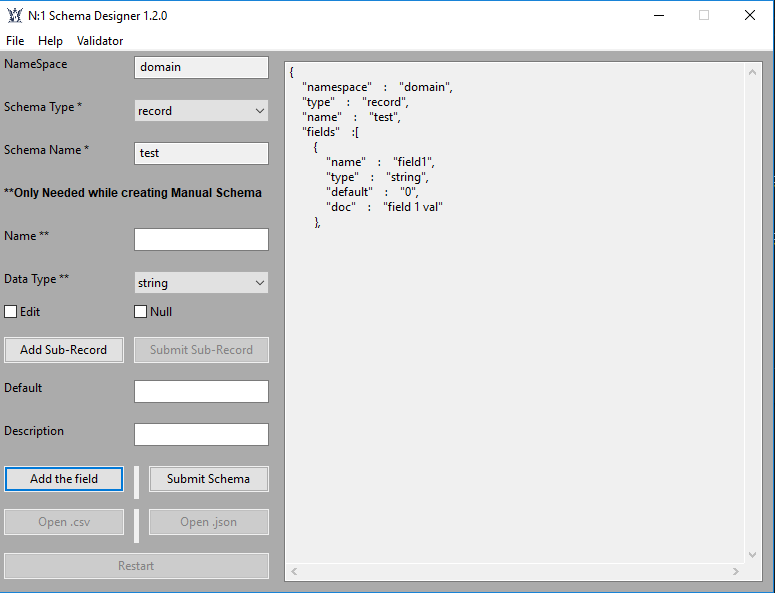
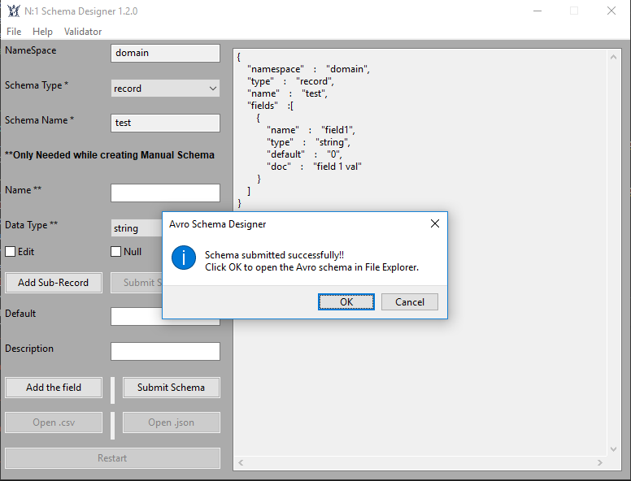
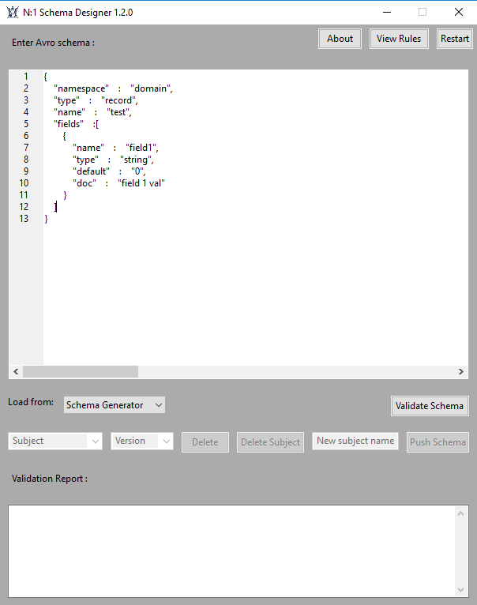
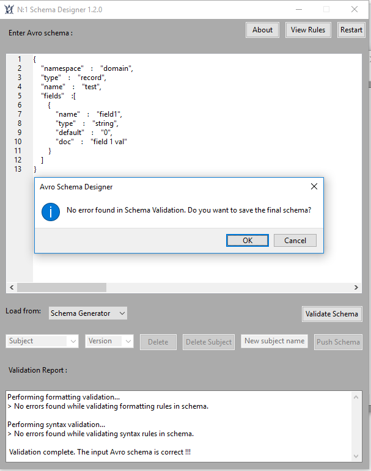
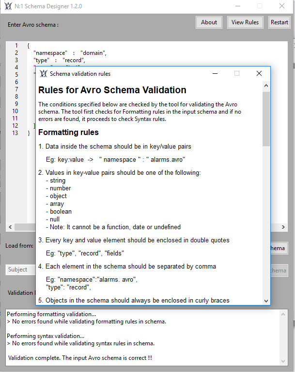

# Avro_Schema_Designer

**Version 1.2.0**
A complete tool to create Avro Schema Files from JSON and CSV files and validate them. User can create Avro Schema files manually as well.
The tool provides a connection to the Schema Registry of kafka Systems for user to pull or push new or existing Avro Schema files. The tool also takes care of the schema versions on in Schema Registry.

---

## Overview

Avro Schema files are used in Schema Registry of Kafka systems to ensure metadata integrity. The tool generates and validates Avro schema files instantly saving manhours of 2 days. A user can create and validate new schemas or existing schemas on local or Schema Registry of kafka Systems

A project created in grad Computer Science class as personal project.

---

## Project Environment

The project is completely developed in Python2 & Python 3.
Following python modules have been used:

1. wxPython --> UI  
2. json     --> Manipulation of json files  
3. six      --> Provides utility functions for smoothing over the differences between the Python versions (2 and 3)  
4. requests --> To push or pull Avro Schme files from Schema Registry of Kafka Systems  
5. ast      --> Process trees of the Python abstract syntax grammar  
6. logging  --> Record logs of all the operations  
7. re       --> Provides regular expression matching operations  
8. pandas, numpy, collections  --> Data manipulation  

---

## Features

1. Create Avro Schema files from  
    i.   JSON  
    ii.  CSV  
    iii. Manually  
2. Validate schemas from  
    i.   manual creation  
    ii.  Auto-generated through the tool  
    iii. Existing on local  
3. Connect to Schema Registry of Kafka Systems to pull or push Avro Schemas  

---

## Guide

1. Run the Stub.py file
2. Create a new schema manually or Open existing file through file menu  
3. Open a csv/json file to create schema  
4. Edit/ add field to the schema using the Edit/Add th field option  
5. If required, add a sub-field  using the "Add Sub-Record" option  
6. Submit Schema to create a schema in local directory  
7. Click on "Validator" button in menu list to open Validator feature
8. Load schema from either local, schema generator or Schema Registry
9. For importing schema from Schema Registry, enter the Kafka System link
10. Once validated, push the schema to Schema Registry with appropriete schema subject and version

---

## Contributors

- Ajinkya Deshmukh <ajinkyad13@gmail.com>

---

## Licence & Copyright

© ajinkyad13

---

## Screenshots of the tool

### Note: Kafka System Schema Registry connection issue will be solved soon